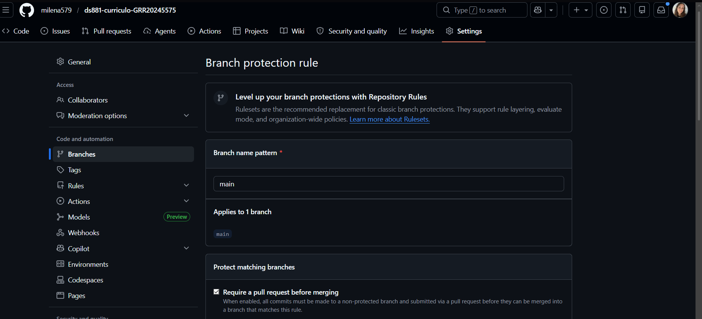

# DS881 - Currículo Online

Projeto individual da disciplina DS881 utilizando React + Vite, Docker, GitHub Actions e GitHub Pages.

---

# Projeto Online

Acesse o currículo publicado:

```txt
https://milena579.github.io/ds881-curriculo-GRR20245575/
```

---

# Tecnologias Utilizadas

* React
* Vite
* Docker
* Docker Compose
* GitHub Actions
* GitHub Pages

---

# Execução Local com Docker

## Pré-requisitos

* Docker Desktop instalado

---

## Executando o projeto

Na raiz do projeto execute:

```bash
docker compose up --build
```

Após iniciar o container, acesse:

```txt
http://localhost:8080
```

---

# Estrutura Docker

O projeto utiliza:

* Dockerfile para configuração do ambiente Node.js
* Docker Compose para orquestração do container
* Bind mounts para hot reload durante o desenvolvimento
* Mapeamento da porta 8080 para acesso local

---

# Workflow de Desenvolvimento

O projeto segue boas práticas de Git e governança de código:

* Proibido push direto na branch `main`
* Todas as alterações realizadas através de branches secundárias
* Integração realizada via Pull Request
* Merge permitido apenas com pipeline verde
* Commits utilizando Conventional Commits

Exemplos:

```txt
feat: adiciona configuração docker
ci: adiciona workflow github actions
docs: atualiza README
```

---

# Proteção da Branch Main

A branch `main` foi protegida utilizando as seguintes regras:

* Require a pull request before merging
* Require status checks to pass before merging
* Require branches to be up to date before merging
* Restrição de push direto para a branch principal

As alterações são integradas apenas via Pull Request.

---

# Pipeline CI/CD

O projeto utiliza GitHub Actions para automação do pipeline.

O workflow realiza:

* Instalação das dependências
* Build da aplicação React/Vite
* Validação automática do projeto
* Deploy automático no GitHub Pages após merge na branch `main`

Arquivo:

```txt
.github/workflows/main.yml
```

---

# GitHub Pages

O deploy é realizado automaticamente através do GitHub Actions.

Configuração utilizada:

```txt
Settings → Pages → Build and deployment → GitHub Actions
```

---

# Como o projeto atende os requisitos da atividade

| Requisito            | Status |
| -------------------- | ------ |
| Dockerfile           | ✅      |
| Docker Compose       | ✅      |
| Bind Mounts          | ✅      |
| Porta 8080           | ✅      |
| Hot Reload           | ✅      |
| Branch Protection    | ✅      |
| Pull Requests        | ✅      |
| Conventional Commits | ✅      |
| GitHub Actions       | ✅      |
| Build Automatizado   | ✅      |
| Deploy Automatizado  | ✅      |
| GitHub Pages         | ✅      |

---
# Evidência de Branch Protection

Adicionar abaixo um print comprovando a configuração da proteção da branch main no GitHub.

Exemplo do local da configuração:

Settings → Branches → Branch protection rules

Sugestão de print:

Regra aplicada para a branch main
Require a pull request before merging
Require status checks to pass before merging
Restrição de push direto



# Autor

Milena Calegari Dourado
